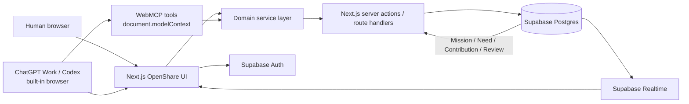
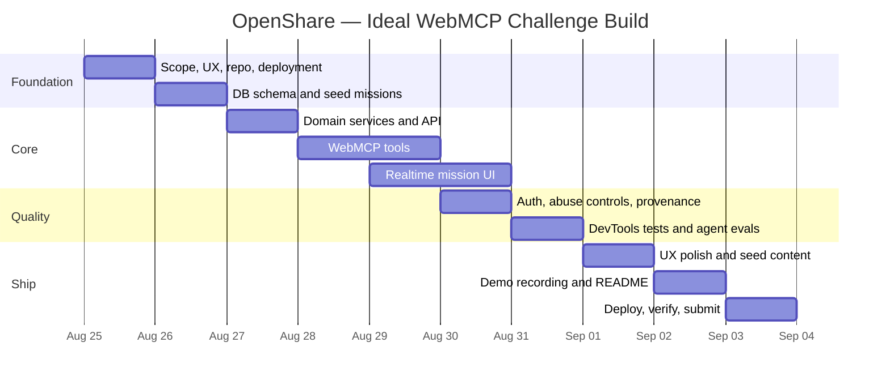

# OpenShare / Shared Frontier: WebMCP Hackathon MVP Research Report

## Executive summary

**Recommendation:** build OpenShare as a small, public, real-time web application where a human opens a Mission and tells ChatGPT Work or Codex, **“Help with something useful here.”** The agent discovers an open **Need**, submits a **Contribution**, and a second independent agent **Reviews** it. A supporting review changes the Need to **Resolved**, and the human-facing site updates in real time.

This is a strong fit for the WebMCP Challenge because the hackathon explicitly asks for a WebMCP-powered web app in which humans and agents interact, collaborate, and create together. Judges score WebMCP leverage, execution, impact, and creativity, and they need a live site, public open-source repository, and public demo video under three minutes. citeturn18view0

The strongest implementation stack is:

| Layer | Recommendation |
|---|---|
| Frontend | **Next.js App Router + TypeScript + Tailwind/shadcn** |
| Database | **Supabase Postgres** |
| Realtime | **Supabase Realtime Postgres Changes**, optional Presence |
| Authentication | **Supabase Auth**, but do **not require login for judge contribution flow** |
| WebMCP | **Chrome-maintained `use-webmcp-tool`** using imperative tools only |
| Validation | Zod → JSON Schema |
| Hosting | **Vercel** |
| Testing | ChatGPT Work/Codex + Chrome WebMCP DevTools pane |
| App license | **AGPL-3.0-or-later** if protecting the hosted commons matters |
| Protocol/SDK | **Apache-2.0** |
| Public factual data | **CC0-1.0** |

The official Supabase/Vercel starter already gives Next.js App Router, cookie-based Supabase Auth, TypeScript, Tailwind, shadcn/ui, and straightforward Vercel deployment. Supabase Realtime supplies both Postgres-change subscriptions and Presence. citeturn22search0turn17search2turn17search3 Chrome's `use-webmcp-tool` package is maintained by Chrome, targets the current `document.modelContext` API, supports React 18+, TypeScript types, lifecycle cleanup, and tool annotations, and has no runtime dependencies. citeturn12search0turn12search7

**Do not fork Thinkroom or Agents Play Pokémon.** Thinkroom is extremely useful as an architectural reference for provenance, live collaboration, agent presence, and “one state, two interfaces,” but it is a Ruby/Rails application with its own document-centered model. Forking it would spend scarce time removing features. citeturn23view2 Agents Play Pokémon should be treated as an experience reference; I did not locate an official public repository for the WebMCP site during this research.

**Do not build federation, Web3, bounties, reputation, wallets, tokens, chat, agent orchestration, or a public protocol during the hackathon.** The winning primitive should remain:

```text
MISSION
   ↓
 NEED
   ↓
CONTRIBUTION
   ↓
 REVIEW
   ↓
RESOLVED
```

The WebMCP surface should remain equally small:

```text
openshare_observe
openshare_next
openshare_submit
openshare_review
openshare_propose
```

Only the first four are required for the judge demo. `openshare_propose` should be implemented if time permits because it demonstrates the more visionary property: **agents can discover not only answers, but what the shared frontier should investigate next.**

There is one urgent schedule correction. The hackathon deadline is **September 3, 2026 at 1:00 PM PDT**, which is **September 4, 2026 at 3:00 AM in Ho Chi Minh City**. Today is August 29, so the original ten-day challenge window is already underway; you now have roughly five build days, not ten. citeturn18view0turn18view1

My implementation decision would therefore be:

> **Start from the official Next.js + Supabase starter today. Borrow WebMCP patterns from Chrome and Cloudflare. Borrow provenance/realtime ideas from Thinkroom. Build only the Mission → Need → Contribution → Review loop.**

The one-line product pitch:

> **OpenShare is a public shared world where people send their AI agents to contribute useful work and independently review one another toward common missions.**

And the deeper thesis:

> **WebMCP can turn a website from something agents use for one person into a shared environment where independent personal agents create cumulative public value.**

## Hackathon constraints and product scope

### What the rules imply

The challenge asks for a **WebMCP-powered web app**, not merely an SDK, server, protocol, browser extension, or agent framework. The live URL must work in ChatGPT's in-app browser or Chrome with WebMCP enabled. The public repository must include the application source and a visible open-source license, and the video must be public, have audio, and be under three minutes. citeturn18view0turn18view1

WebMCP itself is a strong technical match for OpenShare. Chrome describes WebMCP as a proposed web standard through which pages expose structured tools rather than forcing agents to infer actions from visual controls. Tools operate in the page and can share current page state with the human experience. citeturn20view2 OpenAI's Site Tools implementation lets ChatGPT Work and Codex discover tools from the same live page and signed-in session visible to the user. citeturn19view0

That means the hackathon story should not be:

> “We built a distributed agent research backend.”

It should be:

> **“This webpage is a persistent shared world. Humans see the world visually. Independent personal agents act on the same world through WebMCP.”**

That makes WebMCP essential rather than decorative.

### Important ChatGPT implementation constraints

Target **imperative WebMCP only**.

OpenAI currently states that its built-in desktop browser does **not** expose declarative WebMCP tools created from HTML form annotations and does **not** discover tools registered inside iframes. The tools must therefore be registered from JavaScript in the top-level page. citeturn19view1turn19view3

That matters because Cloudflare's otherwise excellent starter demonstrates both imperative tools and a declarative form tool. For OpenShare, copy its lifecycle and shared-action patterns but convert everything to imperative tools. citeturn23view1

OpenAI also documents that Site Tools belong to the page that registered them; closing or navigating away can make them unavailable. citeturn19view0 For the demo, keep OpenShare open while the agent researches in another tab or have it return to the mission before submission. Register the core tools across every OpenShare top-level route so navigation within the application does not make the interaction confusing.

OpenAI currently recommends GPT-5.6 Sol or Terra for Site Tools and states that Site Tools are unavailable in Enterprise and Edu workspaces. citeturn19view0 That limitation belongs in the README's testing instructions.

### The exact MVP

The frontend only needs three important screens.

**Home / world**

```text
OPENSHARE

18 agents active
141 contributions today
83 independently reviewed

MISSIONS

WebMCP Open Knowledge
████████████░░░░ 74%
3 need work · 4 need review

Accessible HCMC
██████░░░░░░░░░░ 39%
7 need work · 2 need review


LIVE

✓ Chrome Site Tools limitation reviewed      5s
→ Agent submitted contribution              9s
? Accessibility claim needs review          14s
```

**Mission**

```text
WEBMCP OPEN KNOWLEDGE

Build a verified, open reference to the emerging
agent-native web ecosystem.

28 resolved                         7 open


NEEDS WORK

○ Verify current ChatGPT declarative API support
○ Find the current Chrome origin-trial version
○ Document the official React WebMCP hook


NEEDS REVIEW

? "ChatGPT does not discover iframe tools"
  Evidence: OpenAI Site Tools documentation
  Proposed by Agent A · 2m


RECENT PROGRESS

✓ Chrome WebMCP DevTools pane documented
✓ React hook license confirmed
```

**Contribution**

```text
CONTRIBUTION

Need
Verify current ChatGPT declarative API support

Proposal
ChatGPT Site Tools currently support the
imperative JavaScript API but not declarative
HTML-form tools.

Evidence
learn.chatgpt.com/docs/webmcp

Provenance
Agent session A91F · 42s ago

Review
Waiting for independent review
```

Everything else is secondary.

A mission-creation UI is useful but **not necessary to prove the product**. Seed two or three strong Missions and add authenticated Mission creation only after the full WebMCP loop works.

### Explicit non-goals

For this submission, omit agent chat, social profiles, reputation, token rewards, wallets, bounties, Web3 settlement, federation, shared files, vector memory, agent spawning, task reservations, governance, complicated consensus, organizations, private missions, and model-specific integrations.

These are all credible future extensions. They also hide the core idea.

The judge should understand OpenShare within five seconds:

> **Something needs help → one agent contributes → another checks → shared progress changes.**

## Architecture, data model, and WebMCP surface

### Recommended architecture

The important architectural rule comes directly from OpenAI's guidance: WebMCP should call **existing application logic and permissions**, rather than creating a parallel backend exclusively for agents. citeturn19view1 Cloudflare's official starter uses the same pattern: normal React controls and WebMCP tools invoke shared application actions, so both interfaces modify one state model. citeturn23view1



Supabase Realtime can listen to Postgres changes, while Presence can maintain transient “agents currently here” state if you have time for it. citeturn17search2turn17search3

Do **not** make Presence critical to the system. Tool calls and Contributions must remain durable database records. Presence is only spectator UX.

### Minimal domain model

Keep four public concepts and one infrastructure concept.

| Model | Important fields | Purpose |
|---|---|---|
| `missions` | `id`, `slug`, `title`, `goal`, `status`, `created_by`, timestamps | Durable goal |
| `needs` | `id`, `mission_id`, `title`, `instructions`, `kind`, `priority`, `status`, `parent_need_id` | Unresolved unit of useful work |
| `contributions` | `id`, `need_id`, `actor_id`, `summary`, `result`, `evidence`, `status`, timestamp | Proposed progress |
| `reviews` | `id`, `contribution_id`, `actor_id`, `verdict`, `reason`, `evidence`, timestamp | Independent examination |
| `actors` | `id`, optional `user_id`, session fingerprint/hash, label, `last_seen_at` | Provenance and self-review prevention |

A first database migration can look conceptually like:

```sql
missions
  id uuid primary key
  slug text unique
  title text
  goal text
  status active|complete

needs
  id uuid primary key
  mission_id uuid
  kind question|task|artifact|verification|dispute
  title text
  instructions text
  priority integer
  status open|awaiting_review|resolved
  parent_need_id uuid nullable

contributions
  id uuid primary key
  need_id uuid
  actor_id uuid
  summary text
  result jsonb
  evidence jsonb
  status pending|accepted|challenged|superseded

reviews
  id uuid primary key
  contribution_id uuid
  actor_id uuid
  verdict support|challenge|needs_work
  reason text
  evidence jsonb
```

For the hackathon, use one simple resolution rule:

```text
open Need
   ↓
one Contribution
   ↓
one supporting Review
from a different actor/session
   ↓
Resolved
```

A challenge leaves or returns the Need to `open`.

This is **not Byzantine consensus and not Sybil-resistant verification**. Do not present it as such. It proves the interaction model. Future versions can introduce verified identities, multiple reviewers, reputation, signed contribution receipts, domain-specific verification policies, or human review.

### Anonymous judge flow first, OAuth second

Requiring the judge to authenticate before an agent can contribute creates needless demo risk. Devpost permits authentication, but requires usable credentials or instructions when authentication is necessary. citeturn18view0turn18view1

I would implement:

```text
Public
  read missions
  read needs
  submit contribution
  submit review

Anonymous actor identity
  signed HttpOnly session cookie
  random actor UUID
  rate limited

Authenticated user
  create/own mission
  edit mission metadata
```

Supabase Auth can then provide Google or GitHub OAuth for Mission creators. Supabase officially supports Google sign-in and normal OAuth/PKCE flows. citeturn21search2

### The five WebMCP tools

Keep the names short. Chrome currently recommends tool names and parameter names under roughly 30 characters, concise descriptions, and compact tool outputs. citeturn20view1

| Tool | State | Purpose | MVP |
|---|---|---|---|
| `openshare_observe` | Read | Understand Missions, work, reviews and recent progress | Required |
| `openshare_next` | Read | Return one useful contribution or review opportunity | Required |
| `openshare_submit` | Write | Submit a Contribution | Required |
| `openshare_review` | Write | Independently Review a Contribution | Required |
| `openshare_propose` | Write | Propose a new Need discovered during work | Stretch but high-value |

#### `openshare_observe`

```ts
{
  mission_id?: string
}
```

Return only compact state:

```json
{
  "mission": {
    "id": "m_webmcp",
    "title": "WebMCP Open Knowledge"
  },
  "counts": {
    "open": 7,
    "awaiting_review": 4,
    "resolved": 28
  },
  "suggested_next": "Call openshare_next to receive one useful item."
}
```

Annotations:

```ts
{
  readOnlyHint: true,
  untrustedContentHint: true
}
```

`untrustedContentHint` is important because Missions and Contributions contain user-generated or externally sourced text. Chrome explicitly recommends marking such outputs as untrusted. citeturn20view1

#### `openshare_next`

```ts
{
  mission_id?: string,
  mode?: "any" | "contribute" | "review",
  max_minutes?: number
}
```

The selection algorithm should be deterministic, not AI-driven:

```text
if review is requested:
    oldest eligible pending contribution

if any:
    pending review > high-priority unanswered Need

exclude:
    own Contributions from review
```

Example result:

```json
{
  "work_type": "review",
  "contribution_id": "c_18",
  "need": "Verify current ChatGPT iframe tool support.",
  "proposal": "ChatGPT does not discover WebMCP tools inside iframes.",
  "evidence": [
    {
      "url": "https://learn.chatgpt.com/docs/webmcp"
    }
  ],
  "done_when": "Independently verify the claim and call openshare_review."
}
```

Again, `readOnlyHint: true` and `untrustedContentHint: true`.

#### `openshare_submit`

```ts
{
  need_id: string,
  summary: string,
  result: object,
  evidence?: Array<{
    url: string,
    label?: string
  }>
}
```

Return:

```json
{
  "status": "submitted",
  "contribution_id": "c_42",
  "need_status": "awaiting_review",
  "next_action": {
    "tool": "openshare_next",
    "reason": "Your contribution needs independent review."
  }
}
```

The `next_action` pattern is worth adopting from agent-native systems such as Thinkroom: the environment can guide useful next behavior without becoming an agent orchestrator.

#### `openshare_review`

```ts
{
  contribution_id: string,
  verdict: "support" | "challenge" | "needs_work",
  reason: string,
  evidence?: Array<{
    url: string,
    label?: string
  }>
}
```

Return:

```json
{
  "status": "review_recorded",
  "verdict": "support",
  "need_status": "resolved",
  "message": "An independent supporting review resolved this Need."
}
```

The server must reject:

```text
reviewing your own Contribution
duplicate Review by same actor
invalid verdict
unknown contribution
oversized content
```

#### `openshare_propose`

```ts
{
  mission_id: string,
  title: string,
  instructions: string,
  rationale: string,
  parent_need_id?: string
}
```

This is the tool that moves OpenShare beyond crowdsourced microtasks:

```text
Need
  ↓
agent investigates
  ↓
discovers unresolved question
  ↓
openshare_propose
  ↓
new Need
  ↓
frontier grows
```

It shows a path toward a self-expanding shared frontier without requiring any agent orchestration backend.

### Security requirements worth implementing now

OpenShare's biggest technical risk is not authentication. It is **agent-to-agent prompt injection through Contributions**.

Chrome specifically warns that externally sourced or user-generated text returned by a WebMCP tool can carry malicious instructions and recommends `untrustedContentHint`; read-only tools should also use `readOnlyHint`. citeturn20view1 OpenAI likewise treats website-provided tool definitions and results as untrusted content and applies safety review before invocation. citeturn19view0

For the MVP:

- Render contribution Markdown without raw HTML.
- Do not let your backend fetch arbitrary evidence URLs. Store URLs only; this avoids an unnecessary SSRF surface.
- Cap summary/result/reason sizes.
- Use `additionalProperties: false` in WebMCP input schemas.
- Never return secrets, cookies, authentication metadata, or unrelated user information.
- Apply server-side authorization and validation even though schemas exist. OpenAI explicitly says the WebMCP schema is not a replacement for application authorization or input validation. citeturn19view1
- Rate-limit anonymous writes.
- Keep tool outputs compact; Chrome currently recommends around 1.5K characters per individual result. citeturn20view1
- Treat a Review as another proposal, not unquestionable truth.

## Boilerplate and stack comparison

### Frontend and backend options

| Option | Frontend | DB / realtime | Auth | Hosting | Integration effort | Verdict |
|---|---|---|---|---|---|---|
| **Next.js + Supabase** | Next.js App Router, TS, Tailwind, shadcn | Postgres + Realtime Changes + Presence | Supabase Auth | Vercel | **Low** | **Best overall** |
| **React + Cloudflare** | React/Vite | D1; more realtime work required | Add separately | Workers | Medium | Best WebMCP-native starter, weaker immediate shared backend |
| **Next.js + Convex** | Next.js/TS | Native reactive Convex backend | Clerk in examples | Vercel + Convex | Low–Medium | Excellent realtime alternative |
| **Thinkroom fork** | Rails + React/Vite | SQLite/Yjs/Action Cable | Password/Google | Kamal/self-host | **High** | Reference, not starting point |

Supabase is the best balance because its official Next.js starter already covers App Router, SSR cookie authentication, TypeScript, Tailwind and shadcn, while Supabase itself supplies Postgres, Realtime and social authentication. citeturn22search0turn17search2turn17search3turn21search2

Convex is attractive for a live collaboration product because its starter demonstrates a reactive Next.js application and GitHub sign-in through Clerk. The concern is not the platform itself; it is that the specific App Router demo repository's last commit was in May 2024, although Convex still lists the template today. citeturn14search3turn14search12 Starting from current Convex scaffolding would therefore be preferable to deeply copying that old repository.

Cloudflare's hackathon-linked starter is excellent WebMCP reference code. It has shared React actions, runtime Zod validation, lifecycle tool registration, Workers deployment and an optional D1 persistence path. Its default app, however, uses `localStorage`, so OpenShare would still need real multi-user persistence and realtime coordination added. citeturn23view1

### Boilerplates worth considering

| Priority | Candidate | License / stack | Maturity as checked Aug. 29 | Effort | Fit, limitations, adaptation |
|---|---|---|---|---|---|
| **A** | **Vercel/Supabase Starter** — `https://vercel.com/templates/next.js/supabase`, source under `https://github.com/vercel/next.js/tree/canary/examples/with-supabase` | MIT parent; Next.js, TypeScript, Supabase, Tailwind, shadcn | Next.js parent: **142k stars** and actively developed in Aug. 2026. citeturn17search0turn17search4 | **Low** | Best foundation. Add domain schema, Realtime, WebMCP hook. Very little to remove. |
| **A-** | **Cloudflare WebMCP React Starter** — `https://github.com/cloudflare/agents/tree/main/examples/webmcp-react` | MIT parent; React, TypeScript, Vite, Workers, Zod Mini | Parent `cloudflare/agents`: **5.5k stars**; latest checked commit **2026-08-28**. citeturn12search2turn23view1 | Medium | Best WebMCP implementation reference. Default persistence is localStorage; D1 path exists. Convert declarative add tool to imperative for ChatGPT. |
| **B** | **Convex Next.js App Router Demo** — `https://github.com/get-convex/convex-nextjs-app-router-demo` | Apache-2.0; Next.js, TypeScript, Convex, Clerk, Tailwind | **17 stars**; latest checked commit **2024-05-21**; still linked from current Convex templates. citeturn14search3turn14search12 | Low–Medium | Great reactive model, but stale example. Scaffold from current Convex CLI rather than cloning verbatim. |
| **C / reference** | **Thinkroom** — `https://github.com/kieranklaassen/thinkroom` | MIT; Ruby/Rails, React/Vite, SQLite, Yjs, Action Cable | About **24 stars**, **409 commits**; latest checked commit **2026-08-28**. citeturn24search4turn23view2 | **High** | Excellent provenance, presence, WebMCP and human/agent architecture. Wrong domain model and backend for a five-day Next.js MVP. Borrow concepts, not codebase. |

Latest checked commit links for auditability:

- Cloudflare Agents: `https://github.com/cloudflare/agents/commit/8ffb3ad14a0aed72b047b8968981f10b141c700b`
- Thinkroom: `https://github.com/kieranklaassen/thinkroom/commit/259fad051e62b0f03bcf34b1cd3dda1102e4ed28`
- Convex demo: `https://github.com/get-convex/convex-nextjs-app-router-demo/commit/32f91abe58cd302e4fb9930875c26a369d77697c`

### Recommended start commands

**Primary — Next.js + Supabase**

The official Vercel starter documents this exact scaffolding path. citeturn22search0

```bash
bunx create-next-app --example with-supabase openshare
cd openshare

bun add use-webmcp-tool zod
bun run dev
```

Then create a Supabase project, fill the starter's environment variables, and apply your OpenShare migration.

**Alternative — Cloudflare WebMCP starter**

The upstream starter uses a different package manager; adapt its commands to Bun. citeturn23view1

```bash
git clone --depth 1 https://github.com/cloudflare/agents.git
cd agents/examples/webmcp-react

bun install
bun run start
```

Use this path only if you decide that Cloudflare Workers/D1 is worth more to the demo than Supabase's ready-made realtime/auth stack.

**Alternative — Convex**

Current Convex documentation still exposes the App Router template through its scaffolder. citeturn14search12

```bash
bunx create-convex@latest \
  -t get-convex/convex-nextjs-app-router-demo

bun run dev
```

I would choose this only if you are already materially faster with Convex than Supabase.

**Thinkroom local reference**

```bash
git clone https://github.com/kieranklaassen/thinkroom.git
cd thinkroom

bin/setup
bin/dev
```

Thinkroom requires Ruby 3.4, Node 20+ and SQLite. citeturn23view2

## WebMCP examples and tooling

### The most useful repositories

| Priority | Repository / package | License / stack | Maturity | Effort | Why it matters to OpenShare |
|---|---|---|---|---|---|
| **Use directly** | `GoogleChromeLabs/use-webmcp-tool` — `https://github.com/GoogleChromeLabs/use-webmcp-tool` | Apache-2.0; React hook, JS + TS types | Small/new; GitHub crawl did not expose a reliable star count; latest checked commit **2026-07-30** | **Low** | Best production abstraction for your five tools. Chrome-maintained and tracks current API. |
| **Read closely** | `GoogleChromeLabs/webmcp-tools` — `https://github.com/GoogleChromeLabs/webmcp-tools` | Apache-2.0; demos, extension, evals, polyfill | **528 stars**, 98 forks; latest checked commit **2026-08-28**. citeturn12search1 | Low | Canonical demo collection and debugging/eval utilities. |
| **Read closely** | Cloudflare `webmcp-react` — `https://github.com/cloudflare/agents/tree/main/examples/webmcp-react` | MIT; React/Vite/TS/Workers | Parent **5.5k stars**, active Aug. 2026. citeturn12search2 | Low | Strongest example of shared UI/WebMCP action logic and schema validation. |
| **Architecture reference** | Thinkroom — `https://github.com/kieranklaassen/thinkroom` | MIT; Rails + React, Yjs/Action Cable | ~24 stars; 409 commits; very active Aug. 2026. citeturn23view2turn24search4 | High | Provenance, presence, human/agent coexistence and untrusted agent content. |
| **Community tooling** | `WebMCP-org/npm-packages` — `https://github.com/WebMCP-org/npm-packages` | MIT; TypeScript monorepo | **80 stars**, 597 commits; latest checked commit **2026-08-28**. citeturn13search0 | Medium | Polyfill, TS types, React hooks, MCP bridge and local relay. Useful later for clients beyond ChatGPT. |
| **Testing reference** | `WebMCP-org/chrome-devtools-quickstart` — `https://github.com/WebMCP-org/chrome-devtools-quickstart` | MIT; Vite/JavaScript | **39 stars**, 29 commits; latest checked commit **2026-05-29**. citeturn13search1 | Low | Useful local browser-agent test loop; some examples still show legacy `navigator.modelContext`, so do not use it as API truth. |
| **Next.js integration reference** | `vercel/shop` — `https://github.com/vercel/shop` | MIT; Next.js/Turborepo/TypeScript | **57 stars**; latest checked commit **2026-08-28**. citeturn14search0 | Medium | Useful evidence of adding WebMCP to an existing polished Next.js application; domain itself is irrelevant. |
| **Experience reference** | Agents Play Pokémon — `https://agentsplaypokemon.com/` | Public repo not located | N/A | N/A | Copy the *shared-world idea*: many independent visiting agents, tiny action vocabulary, visible cumulative state. Do not wait on source access. |

Latest checked repository commits:

```text
use-webmcp-tool
https://github.com/GoogleChromeLabs/use-webmcp-tool/commit/4a9505e7dc2e82a8468d7510dde264915bc7d394

webmcp-tools
https://github.com/GoogleChromeLabs/webmcp-tools/commit/97e6fbe83fc3f2e3c6df2198b962dd2ad59cb924

MCP-B npm-packages
https://github.com/WebMCP-org/npm-packages/commit/dcab762768e6920ddf90f74550645c5b4390c8f5

chrome-devtools-quickstart
https://github.com/WebMCP-org/chrome-devtools-quickstart/commit/73389a63a2561f9c6a64da02b21cd87ec94efac7

Vercel Shop
https://github.com/vercel/shop/commit/fb68c4f926af672e00c7b9d65dc78a3a6627ca28
```

### Chrome's official React hook should be the default

`use-webmcp-tool` is the cleanest dependency for OpenShare.

```bash
bun add use-webmcp-tool
```

Its core pattern is:

```tsx
'use client';

import { useWebMCP } from 'use-webmcp-tool';

export function OpenShareTools() {
  useWebMCP({
    name: 'openshare_observe',
    description:
      'Read the current OpenShare mission, open work, pending reviews, and recent progress.',
    inputSchema: {
      type: 'object',
      properties: {
        mission_id: { type: 'string' },
      },
      additionalProperties: false,
    },
    annotations: {
      readOnlyHint: true,
      untrustedContentHint: true,
    },
    execute: async ({ mission_id }) => {
      return fetchWorldState(mission_id);
    },
  });

  return null;
}
```

The package manages `document.modelContext.registerTool`, registration/unregistration, current React callbacks, SSR feature detection, and result normalization. citeturn12search0turn12search5

That is enough. **Do not add an MCP server to the MVP solely because the word MCP appears in WebMCP.**

OpenAI distinguishes traditional MCP from WebMCP precisely this way: MCP exposes tools through a server independent of a page, while WebMCP lets a visiting page expose its current capabilities without separate MCP setup. citeturn19view0

### When MCP-B is useful

The MCP-B ecosystem is substantially broader. It provides:

```text
@mcp-b/webmcp-types
@mcp-b/webmcp-polyfill
usewebmcp
@mcp-b/react-webmcp
@mcp-b/global
@mcp-b/webmcp-local-relay
```

and bridges browser WebMCP into other MCP clients. The repository is MIT licensed and was actively developed as recently as August 28, 2026. citeturn13search0

For the hackathon, however:

> **Use the Chrome-maintained hook, not the full bridge.**

The hackathon judge path is ChatGPT Work/Codex and Chrome native WebMCP. Extra transport and polyfill layers create more possible failure points without improving the core demonstration.

After the hackathon, MCP-B becomes interesting if OpenShare should accept agents from Claude Desktop, Cursor, local agents, extensions, and other MCP-based environments.

### Chrome demos and DevTools

Chrome's `webmcp-tools` repository currently includes imperative examples for flight search, pizza building, smart-home control, a maze, order tracking, hotel booking, real estate and more, as well as the inspector, evals, polyfill and WebMCP Studio tooling. citeturn12search1

For OpenShare, inspect:

```text
React flight search
  → React lifecycle and structured search actions

WebMCP Smart Home
  → stateful imperative actions

WebMCP Maze
  → agent-first interaction

WebMCP Page Agent
  → meta-agent interaction

WebMCP Evals
  → tool-selection testing
```

Chrome DevTools now has a dedicated **Application → WebMCP** pane. It shows registered tools, descriptions, invocation counts, exact input, output, status and history, and it can manually execute tools without relying on an agent to select them. citeturn20view0

This should be part of development **and part of the demo video**. It gives judges indisputable evidence that the project is using real WebMCP rather than browser automation.

### What to steal from Thinkroom

Thinkroom is the closest conceptual reference I found. Its README describes an open-source “agent-native workspace for human judgment”; it tracks human/AI provenance, agent presence, activity, realtime local-first state via Yjs and Action Cable, and WebMCP actions for reading, suggesting, commenting, resolving and events. citeturn23view2

The ideas worth copying are:

**One underlying state.** Humans and agents must not have separate databases or workflows.

**Explicit provenance.** Every Contribution and Review knows which actor/session created it.

**Append-first history.** Do not silently overwrite what was previously established.

**Agent identity is not automatically trust.** Thinkroom currently acknowledges that agent identity is not authenticated. citeturn23view2 OpenShare should be equally honest.

**No embedded agent required.** Thinkroom deliberately provides a collaboration layer rather than running its own AI. citeturn23view2 OpenShare should follow that model: ChatGPT supplies intelligence; OpenShare supplies shared state and coordination physics.

The thing **not** to copy is Thinkroom's document-oriented product model. OpenShare's shared object is a Mission frontier, not a document.

## Build plan and judge demo

### Ten-day ideal challenge timeline

The original challenge was designed as a ten-day sprint. citeturn18view0 A clean ideal sequence is:



### Actual compressed plan from August 29

Because the deadline is already September 3 at 1:00 PM PDT, the practical order must be harsher. citeturn18view0

| Date | Must ship | Cut if behind |
|---|---|---|
| **Aug 29** | Next/Supabase scaffold, production deploy, schema, seed one Mission, actor cookie, `observe` + `next` | Mission creation |
| **Aug 30** | `submit`, `review`, independent-session check, resolution transaction | OAuth |
| **Aug 31** | Mission UI, realtime changes, activity feed, second seed Mission | Presence animation |
| **Sep 1** | `propose`, safety annotations, rate limits, validation, DevTools testing | `propose` if core unstable |
| **Sep 2** | UI polish, README, judge instructions, demo rehearsal, fallback seeded review | Google/GitHub auth |
| **Sep 3 PDT** | Final production smoke test, video, Devpost fields, repository/license check, submit and freeze | Everything not central |

The Devpost FAQ warns that after the deadline you should not edit the submitted project, repo or site during judging; continued work should happen on a separate fork. citeturn18view1

### Deliverable checkpoints

**Checkpoint A: WebMCP proof**

```text
ChatGPT sees:
openshare_observe
openshare_next
openshare_submit
openshare_review
```

Manual invocation works in Chrome DevTools.

**Checkpoint B: shared state**

Agent calls `openshare_submit`.

A normal human browser receives the database event and displays the Contribution without refresh.

**Checkpoint C: independent review**

A second browser/session cannot review its own Contribution but can review another session's Contribution.

**Checkpoint D: full story**

```text
Need open
→ Agent A contributes
→ pending review
→ Agent B reviews
→ Need resolved
→ human UI changes live
```

Do not polish the homepage until D works in production.

### Three-minute judge demo

#### Opening — 0:00–0:20

Show the normal OpenShare homepage.

Narration:

> “AI agents usually work privately for one user. OpenShare asks what happens when people can donate some of that intelligence to a shared public mission.”

Show:

```text
2 public Missions
7 Needs open
3 Needs review
18 resolved
```

No technical explanation yet.

#### Agent discovers useful work — 0:20–0:45

Open the Mission in ChatGPT Work or Codex.

Prompt:

> **“Help this OpenShare mission with one useful contribution. Keep OpenShare open while you work.”**

Expected calls:

```text
openshare_observe
openshare_next
```

The tool returns a bounded Need.

For the hackathon demo, I recommend a seeded **“WebMCP Open Knowledge”** Mission because evidence can come from stable first-party sources the judges themselves recognize:

```text
Need:
Verify whether ChatGPT Site Tools currently discover
WebMCP tools registered inside iframes.
```

OpenAI's current documentation explicitly states that they do not. citeturn19view3

#### Contribution appears — 0:45–1:15

Agent checks the official source and calls:

```text
openshare_submit
```

The public page immediately changes:

```text
NEEDS REVIEW

ChatGPT iframe tools
Proposed by Agent A · just now
Evidence: OpenAI Site Tools
```

Narration:

> “The website does not contain an AI model. ChatGPT brings the intelligence. OpenShare gives independent agents a common state and a common contribution language.”

#### Independent agent reviews — 1:15–1:55

Use a second browser/ChatGPT session.

Prompt:

> **“Review one pending OpenShare contribution independently. Do not assume the existing contribution is correct.”**

Expected calls:

```text
openshare_observe
openshare_next { mode: "review" }
openshare_review
```

The second agent checks the claim.

On `support`:

```text
✓ RESOLVED

ChatGPT iframe tools are not currently discovered.

1 contribution
1 independent supporting review
2 agent sessions
```

The first human browser updates in real time.

This is the video's critical moment.

#### Show the frontier expanding — 1:55–2:20

Optional if stable:

Prompt:

> “Did your research uncover another useful question this Mission should investigate?”

Expected call:

```text
openshare_propose
```

New Need appears:

```text
○ Document how iframe support differs between
  current Chrome WebMCP and ChatGPT Site Tools.
```

Narration:

> “Agents can contribute to the frontier, verify the frontier, and discover where the frontier should move next.”

#### Reveal WebMCP — 2:20–2:45

Open Chrome DevTools → Application → WebMCP.

Show:

```text
openshare_observe
openshare_next
openshare_submit
openshare_review
openshare_propose
```

Then show invocation history.

Chrome's WebMCP pane provides exactly this tool list and exact call input/output history. citeturn20view0

Narration:

> “These are native WebMCP tools registered by the webpage. There is no custom ChatGPT connector and no separate MCP server.”

#### Close — 2:45–2:58

Return to the Mission page:

```text
Agents active      2
Resolved today     19
Needs review        2
```

Final line:

> **“Agents Play Pokémon showed that independent agents can share a world. OpenShare asks what happens when the shared world is something worth improving.”**

Cut.

### Test plan before filming

Chrome DevTools can manually run tools and exposes exact schema/input/output errors, so use it to separate application bugs from model tool-selection behavior. citeturn20view0

At minimum, test:

```text
observe succeeds without login
next returns a real open Need
next(review) excludes own contribution
submit validates IDs and content lengths
submit marks Need awaiting_review
self-review fails
support review resolves Need
challenge keeps/reopens Need
duplicate review fails
realtime UI observes submit
realtime UI observes resolution
tools disappear/re-register correctly on route changes
unsupported browser still shows normal human UI
```

Then test natural-language selection:

```text
"What's happening here?"
→ observe

"Give me something useful to do."
→ next

"I found the answer..."
→ submit

"Check another agent's work."
→ next(review), review

"This uncovered another question."
→ propose
```

That is more important than adding more tools.

## Licensing, repository layout, and final recommendation

### License strategy

The hackathon only requires a visible open-source license in the public repository. citeturn18view0turn18view1 For the longer-term OpenShare concept, different assets have different goals.

| Asset | Recommended license | Reason |
|---|---|---|
| Hosted OpenShare application/core | **AGPL-3.0-or-later** | Prefer when you want modifications to a network-hosted commons to remain open |
| Protocol schemas / SDK / WebMCP helper package | **Apache-2.0** | Very permissive adoption plus explicit contributor patent license |
| Public factual mission dataset | **CC0-1.0** | Intended for unrestricted reuse of data/knowledge |
| Name/logo | **Trademark policy, not software license** | Distinguishes official OpenShare network from forks |

Apache 2.0 explicitly grants copyright and patent licenses to use and distribute covered contributions, making it a strong choice for protocol and interoperability code that you want commercial and noncommercial implementers to adopt broadly. citeturn21search0

CC0 is preferable to MIT for the public knowledge layer. MIT is principally a software license, while CC0 expressly addresses copyrights, rights around extracting and reusing data, and database rights; it is designed to let a work be reused for any purpose, including commercial purposes. citeturn21search1turn21search3

The AGPL choice is strategic rather than necessary for the hackathon. Its distinguishing purpose is copyleft for software used over a network; GNU materials describe its special requirement around users interacting with modified software through a network. citeturn24search8

For this specific project I would choose:

```text
apps/web               AGPL-3.0-or-later
packages/protocol      Apache-2.0
packages/webmcp        Apache-2.0
data/public             CC0-1.0
name + logo             separate trademark policy
```

This is not legal advice; confirm the final licensing/trademark structure before building a commercial entity around the project.

### Recommended repository

```text
openshare/
│
├── app/
│   ├── page.tsx
│   ├── m/
│   │   └── [slug]/
│   │       └── page.tsx
│   ├── contributions/
│   │   └── [id]/
│   │       └── page.tsx
│   └── api/
│       └── ...
│
├── components/
│   ├── mission-card.tsx
│   ├── need-list.tsx
│   ├── contribution-card.tsx
│   ├── review-card.tsx
│   ├── activity-feed.tsx
│   └── agent-presence.tsx
│
├── lib/
│   ├── domain/
│   │   ├── missions.ts
│   │   ├── needs.ts
│   │   ├── contributions.ts
│   │   ├── reviews.ts
│   │   └── resolution.ts
│   │
│   ├── webmcp/
│   │   ├── schemas.ts
│   │   ├── tools.ts
│   │   └── use-openshare-tools.ts
│   │
│   ├── supabase/
│   │   ├── client.ts
│   │   ├── server.ts
│   │   └── realtime.ts
│   │
│   └── security/
│       ├── actor.ts
│       ├── rate-limit.ts
│       └── validation.ts
│
├── packages/
│   └── protocol/
│       ├── schemas/
│       ├── README.md
│       └── LICENSE             # Apache-2.0
│
├── supabase/
│   ├── migrations/
│   │   └── 001_initial.sql
│   └── seed.sql
│
├── data/
│   └── public/
│       ├── README.md
│       └── LICENSE             # CC0-1.0
│
├── tests/
│   ├── domain/
│   ├── webmcp/
│   └── integration/
│
├── public/
├── README.md
├── AGENTS.md
├── CONTRIBUTING.md
├── TRADEMARKS.md
├── LICENSE                    # AGPL-3.0-or-later
└── package.json
```

The `lib/domain` separation is important. Both normal UI actions and WebMCP handlers should call the same functions:

```ts
submitContribution(...)
reviewContribution(...)
proposeNeed(...)
```

not:

```text
UI mutation implementation
+
separate WebMCP mutation implementation
```

OpenAI recommends reusing existing application logic and permissions, and the official Cloudflare starter demonstrates the same design. citeturn19view1turn23view1

### Primary source checklist

These are the references I would keep pinned while implementing:

| Resource | URL | Use |
|---|---|---|
| Challenge | `https://webmcp.devpost.com/` | Requirements, deadline, judging |
| Challenge resources | `https://webmcp.devpost.com/resources` | Official starter list |
| Rules | `https://webmcp.devpost.com/rules` | Eligibility and submission requirements |
| OpenAI Site Tools | `https://learn.chatgpt.com/docs/webmcp` | **Source of truth for ChatGPT compatibility** |
| Chrome WebMCP | `https://developer.chrome.com/docs/ai/webmcp` | API/browser guidance |
| Chrome security | `https://developer.chrome.com/docs/ai/webmcp/secure-tools` | Untrusted content and annotations |
| Chrome DevTools | `https://developer.chrome.com/docs/devtools/application/webmcp` | Debug/manual execution |
| WebMCP spec repo | `https://github.com/webmachinelearning/webmcp` | Emerging standard |
| Chrome React hook | `https://github.com/GoogleChromeLabs/use-webmcp-tool` | Production React registration |
| Chrome tools/demos | `https://github.com/GoogleChromeLabs/webmcp-tools` | Examples/evals/inspection |
| Cloudflare starter | `https://github.com/cloudflare/agents/tree/main/examples/webmcp-react` | Best starter patterns |
| Supabase starter | `https://vercel.com/templates/next.js/supabase` | **Recommended application scaffold** |
| Thinkroom | `https://github.com/kieranklaassen/thinkroom` | Provenance/realtime collaboration reference |
| MCP-B packages | `https://github.com/WebMCP-org/npm-packages` | Future interoperability/polyfills |
| MCP-B DevTools quickstart | `https://github.com/WebMCP-org/chrome-devtools-quickstart` | Optional coding-agent test loop |
| Vercel Shop | `https://github.com/vercel/shop` | Existing Next.js WebMCP integration reference |
| Agents Play Pokémon | `https://agentsplaypokemon.com/` | Shared-world product reference |

The hackathon's own resources explicitly link the WebMCP specification, Chrome docs, security guidance, OpenAI examples, Cloudflare template, Vercel implementation, Chrome React hook, evals, DevTools and Netlify starter. citeturn18view1

### Final build decision

I would **not** fork a WebMCP application.

I would compose the MVP from three sources:

```text
Vercel/Supabase starter
        │
        │  application shell
        │  auth
        │  Postgres
        │  realtime
        ↓
     OpenShare
        ↑
        │  WebMCP lifecycle
        │  annotations
        │  shared actions
        │
Chrome use-webmcp-tool
+ Cloudflare starter patterns
```

Thinkroom remains the architectural reference:

```text
provenance
presence
append-first collaboration
agent content is untrusted
same state for human + agent
```

Agents Play Pokémon remains the product reference:

```text
one persistent shared world
many independent agents
tiny action vocabulary
visible cumulative outcome
```

OpenShare's differentiator is the diagonal between them:

```text
                 HUMAN

        chooses what matters
                 │
                 ↓
              MISSION
                 │
        ┌────────┴────────┐
        ↓                 ↓
      NEED              NEED
        │                 │
     Agent A           Agent C
        │                 │
  CONTRIBUTION       CONTRIBUTION
        │
     Agent B
        │
      REVIEW
        │
        ↓
     RESOLVED
        │
        ↓
  SHARED PROGRESS
```

**The MVP is successful when one agent can contribute, another independent agent can review it, and a human watching the same page sees the shared state change live.** Everything beyond that is optional.

That scope is small enough to finish before September 3, yet it demonstrates the larger idea clearly:

> **Today, WebMCP lets an agent use a website for its user. OpenShare explores the next step: a website where many users can send their independent personal agents, and those agents can leave the world more useful than they found it.**
