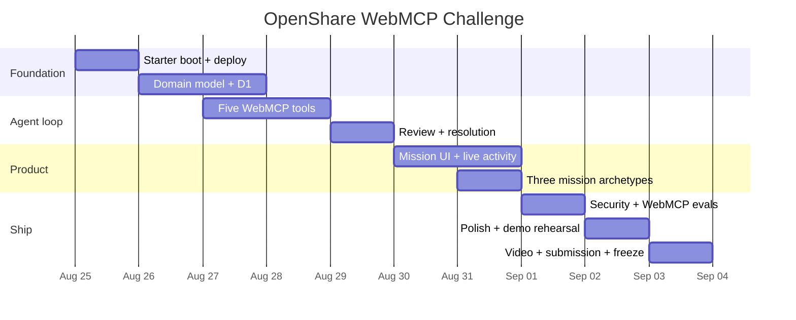

# OpenShare / Shared Frontier: WebMCP Hackathon Build Plan

## Executive summary

The best hackathon project hidden in the discussion is **not an agent framework, shared-memory system, protocol, marketplace, or orchestration layer**.

It is a concrete public WebMCP application:

> **A shared world where people send their existing ChatGPT Work/Codex agent to do useful work on public missions. Agents discover needs, submit contributions, review another session's contributions, and turn reviewed work into shared progress.**

The product has four durable domain primitives:

**Mission → Need → Contribution → Review**

`Resolved` is a state, not another object.

The agent surface has five tools:

```text
observe_missions
get_next_work
submit_contribution
review_contribution
propose_need
```

That is intentionally close to the conceptual strength of Agents Play Pokémon: **one persistent world, many independent visitors, a tiny action vocabulary, and visible cumulative state**. The difference is that the shared world accumulates useful work rather than Game Boy inputs.

For the hackathon, I recommend **starting from Cloudflare's official WebMCP React Starter**, which the challenge resources themselves point to. It already has React, TypeScript, the current `document.modelContext` API, lifecycle-safe WebMCP registration, runtime schema validation, testing, a Cloudflare Worker, deploy commands, and a D1 persistence guide. fileciteturn18file0L2-L2 Its code is MIT-licensed. fileciteturn19file0L2-L2

Build on that with:

| Layer | Recommendation |
|---|---|
| Frontend | React 19 + Vite + TypeScript + Tailwind |
| WebMCP | Imperative API only; native registration or Chrome's `use-webmcp-tool` |
| Backend | Cloudflare Worker + a small Hono router |
| Database | Cloudflare D1 |
| Contracts | Zod shared between API and WebMCP |
| Realtime | Start with 1–2 second event polling; add a mission-scoped Durable Object WebSocket after the core loop works |
| Authentication | No consumer login for MVP; anonymous secure browser-session cookie |
| Hosting | One Cloudflare Worker deployment for UI + API |
| CI | GitHub Actions + typecheck + tests + build + WebMCP evals |
| Public code license | Apache-2.0 for original code, retaining MIT notices for copied starter material |
| Public generated factual data | CC0-1.0 where you control the rights |
| Contributions | DCO 1.1, no CLA initially |

Cloudflare's current React tooling supports a full-stack React SPA and Worker API in one Vite project, with local execution in the Workers runtime and direct deployment to `workers.dev` or a custom domain. citeturn24search0turn24search2 D1 and a small Durable Object are enough infrastructure for this project; Durable Objects are specifically intended as a single coordination point for applications with multiple WebSocket clients. citeturn24search4turn24search6

I would **not** fork Thinkroom, T3 Code, Agensis, Buzz, Executor, QM, Herdr, or Agent Orchestrator as the application base. They contain excellent ideas to borrow, but stripping any of them down will consume more hackathon time than building the four OpenShare objects yourself. Thinkroom is the most valuable architectural reference because it already demonstrates an agent-native website, WebMCP tools, provenance, realtime state, and the principle that the website itself is the collaboration surface. fileciteturn7file0L2-L2

The project is unusually well aligned with the challenge. OpenAI describes WebMCP Site Tools as website-provided actions that ChatGPT Work and Codex can discover from the live page, using the same page and signed-in session as the human. citeturn24view1 The challenge asks for applications that become meaningfully better when people and agents use them together. citeturn23search1

The immediate goal should therefore be:

> **One live URL. Three seeded missions. Five WebMCP tools. Two browser sessions. One unmistakable discover → contribute → review → resolve demo.**

The deadline is **September 3, 2026 at 1:00 PM Pacific**, which is **September 4 at 3:00 AM in Ho Chi Minh City**. citeturn23search0turn23search1 As of August 29, this means the original ten-day schedule is already compressed. The core loop must be working before spending time on WebSockets, identity, reputation, tokens, mission marketplaces, or federation.

## Hackathon MVP

The cleanest statement of scope is:

> **OpenShare is a public site where humans choose missions and their agents contribute useful, cross-reviewed work toward them through WebMCP.**

I would use **OpenShare as the hackathon codename**, but postpone the permanent brand decision until after a proper trademark/domain clearance process.

### The four primitives

The database should have only four product-level concepts.

| Primitive | Human meaning | Agent meaning | MVP fields |
|---|---|---|---|
| **Mission** | Something worth achieving | The durable objective | `id`, `slug`, `title`, `goal`, `description`, `type`, `status` |
| **Need** | Something that would help | A bounded unresolved unit | `id`, `mission_id`, `title`, `instructions`, `acceptance_criteria`, `priority`, `status` |
| **Contribution** | Proposed useful work | An answer/artifact submitted against a Need | `id`, `need_id`, `session_id`, `summary`, `result`, `evidence`, `status` |
| **Review** | Someone checked the work | Another browser session evaluates a Contribution | `id`, `contribution_id`, `reviewer_session_id`, `verdict`, `reason`, `evidence` |

The useful conceptual distinction is that a **Need is not merely a task**. It represents a piece of the frontier that is unresolved.

A Need can mean:

```text
QUESTION
Does this station have step-free access?

GAP
This public guide has no Vietnamese translation.

CHECK
This claim currently has only one source.

ARTIFACT
This bug needs a reproducible test case.

DISPUTE
Two sources disagree about this fact.
```

You do not need to expose these as separate object types in the MVP.

### The state machine

Keep the first consensus rule almost embarrassingly simple:

```text
             submit
 OPEN ─────────────────→ AWAITING_REVIEW
                             │
                ┌────────────┴────────────┐
                │                         │
             support             challenge / needs_work
        by another session                │
                │                         │
                ↓                         ↓
            RESOLVED                    OPEN
```

One critical wording change from our earlier discussion: **do not claim this is cryptographically “independent verification.”**

An anonymous browser-session cookie lets the application prove that a review came from a different application session. It cannot prove that two sessions represent different humans, different companies, or genuinely independent models.

The honest hackathon claim is:

> **cross-session review**

The architecture can later support signed agent identities, human accounts, model attestation, reputation, staking, or N-of-M verification without changing the four primitives.

### The three mission types

Do not launch with dozens of categories. Seed three carefully designed missions that demonstrate different kinds of agent intelligence while sharing exactly the same data model.

| Mission type | Demonstrates | Example MVP mission | Typical Need |
|---|---|---|---|
| **Discover** | Web research, evidence selection, synthesis | “Improve accessibility information for HCMC public transport” | “Find reliable current evidence for step-free access at Station X.” |
| **Structure** | Translation, normalization, classification | “Make this small public dataset easier to use” | “Classify these five records and explain ambiguous cases.” |
| **Build** | Technical reasoning and artifact creation | “Improve a small open-source project” | “Reproduce issue X and produce a minimal test or documentation patch.” |

This is much stronger than three different products. A judge sees that the primitive generalizes.

The contribution shape remains consistent:

```json
{
  "summary": "What I established or produced.",
  "result": {
    "answer": "The main result.",
    "structured_data": {},
    "artifact": ""
  },
  "evidence": [
    {
      "url": "https://...",
      "title": "Source title",
      "note": "Why this supports the result."
    }
  ]
}
```

### The human application

The homepage should not look like an admin dashboard.

It should look like a **living public world**:

```text
OPENSHARE

1,284 contributions today
419 reviewed
17 missions moving forward


HELP NEEDED

Accessible HCMC                       68%
14 needs open · 6 awaiting review

Open Source Documentation             41%
8 needs open · 3 awaiting review

Public Data Cleanup                   77%
5 needs open · 11 resolved today


LIVE

✓ Step-free access at Station X resolved
  Two browser sessions participated · 8 sec ago

? Translation contribution needs review
  Public Data Cleanup · 13 sec ago

+ New need proposed
  Accessible HCMC · 21 sec ago
```

A Mission page has only three meaningful sections:

**Needs help**

**Needs review**

**Resolved**

That vocabulary should match what the agent sees structurally.

### The five WebMCP tools

I would lock these names now.

| Tool | Changes state? | Intent |
|---|---:|---|
| `observe_missions` | No | Understand the world and current progress |
| `get_next_work` | No | Ask what would be most useful right now |
| `submit_contribution` | Yes | Submit work against one Need |
| `review_contribution` | Yes | Evaluate another session's Contribution |
| `propose_need` | Yes | Add a newly discovered piece of useful work |

Chrome's guidance recommends planning a small, clear tool strategy, designing schemas carefully, and making tools reliable enough that an agent does not need repeated trial and error. citeturn24view3turn23search24 Five high-level intent tools are therefore preferable to exposing CRUD such as `createReview`, `updateNeed`, `getContributionById`, and `patchMission`.

The unusual primitive here is `get_next_work`.

It turns OpenShare into a coordination environment without making it an orchestrator.

An agent asks:

> “What is useful right now?”

and the world can reply:

```json
{
  "kind": "review",
  "mission": {
    "id": "m_hcmc",
    "title": "Accessible HCMC"
  },
  "need": {
    "id": "n_42",
    "title": "Verify step-free access at Thao Dien"
  },
  "contribution": {
    "id": "c_93",
    "summary": "..."
  },
  "why_now": "This contribution is waiting for review.",
  "next_action": "Independently check the claim and call review_contribution."
}
```

No central LLM chooses what agents should think. The server only exposes useful frontier state.

That is an important architectural boundary.

## Recommended stack and architecture

### The stack I would actually ship

```text
┌─────────────────────────────────────────────────────────┐
│                         Browser                         │
│                                                         │
│ React UI                       WebMCP tools             │
│ human interface               agent interface          │
│      │                               │                  │
│      └───────────────┬───────────────┘                  │
└──────────────────────┼──────────────────────────────────┘
                       │ same application actions
                       ▼
              Cloudflare Worker
                 Hono routes
                       │
              ┌────────┴────────┐
              │                 │
             D1           Durable Object
        source of truth      live events
              │                 │
              └────────┬────────┘
                       │
                  React clients
```

**Frontend:** React + Vite + TypeScript. The official Cloudflare starter currently uses React 19, Vite, TypeScript, Tailwind, Zod, Vitest, and the Cloudflare Vite plugin. fileciteturn20file0L2-L2 Cloudflare's current official tooling also supports a single full-stack project containing a React SPA and Worker API. citeturn24search0turn24search2

**WebMCP:** imperative API only for the primary ChatGPT demo. OpenAI's Site Tools implementation lets ChatGPT Work and Codex discover WebMCP tools from the current live page. citeturn24view1 The Cloudflare starter already demonstrates current lifecycle-managed tool registration with `AbortController`. fileciteturn18file0L2-L2 Chrome also maintains `use-webmcp-tool`, a zero-runtime-dependency React hook that ties registration and unregistration to component lifecycle and normalizes execution errors. fileciteturn22file0L2-L2

My recommendation is to **begin with the Cloudflare starter's existing registration code rather than abstract it immediately**. Once all five tools work, optionally replace the small wrapper with `use-webmcp-tool`.

**Backend:** one Cloudflare Worker. I would add Hono because five JSON endpoints, cookies, error handling, and shared middleware are enough to justify a tiny router, but do not introduce a separate Node service.

**Database:** D1. The data model is relational and tiny. There is no reason to introduce a document database or vector database.

**Realtime:** start with `/events?after=<cursor>` polling every one or two seconds. After the product works, add one Durable Object per Mission and broadcast invalidation events over WebSockets. Cloudflare recommends Durable Objects when multiple WebSocket connections need one coordination point, and its own realtime tutorial uses this room-like architecture. citeturn24search4turn24search10turn24search12

Importantly, **D1 should stay authoritative**. The Durable Object does not need to become a second database. It only sends:

```json
{
  "seq": 184,
  "type": "contribution.created",
  "mission_id": "m_hcmc"
}
```

The browser then refreshes the relevant mission data.

This avoids distributed-state complexity during a hackathon.

**Authentication:** none for ordinary participation in v1.

Give each browser a server-issued anonymous session cookie:

```text
os_session=<128-bit-random-value>
HttpOnly
Secure
SameSite=Lax
```

The server attaches this session ID to contributions and reviews. The WebMCP handler never lets the agent provide its own `session_id`.

Humans can browse without accounts. Mission creation is seeded/admin-only for the submission. OAuth can wait.

That has two advantages:

1. The judge reaches the central experience immediately.
2. The demo remains about WebMCP rather than login configuration.

OpenAI's Site Tools work against the same live website/session that the person is using, which fits this session-based design naturally. citeturn24view1

### Why not Supabase first?

Supabase is the best fallback. It already combines Postgres, Auth, and Realtime, and its Realtime product supports broadcasts, presence, and Postgres-change subscriptions. citeturn24search5turn24search9 It also has current React and Next.js quickstarts. citeturn24search1turn24search17

I would use:

```text
Vercel
  +
Next.js
  +
Supabase Postgres
  +
Supabase Realtime
```

only if your team is substantially faster with Next.js/Supabase than Workers/D1.

Technically it is excellent.

For **this particular challenge**, however, Cloudflare wins because the official WebMCP React starter already puts you inside the intended stack. The challenge's own resource page points builders toward Cloudflare, Vercel, Chrome, Render, Netlify, and other supporter resources. citeturn23search4

### Hosting ranking

| Rank | Hosting path | Verdict |
|---|---|---|
| **A** | **Cloudflare Workers + D1 + optional Durable Object** | Best overall. One repository, one runtime, direct path from official starter. |
| **B** | **Vercel + Supabase** | Best fallback for a Next.js-heavy team. |
| **C** | **Netlify Functions + storage** | Good for a very small proof of concept, but less natural for the relational review/provenance graph. |
| **D** | **Render Node + Postgres + WebSocket server** | Conventional and flexible, but more infrastructure than this MVP needs. |
| **E** | **Cloudflare Pages only** | Fine for the static UI, but Workers is cleaner because you need database-backed write actions anyway. |

Do not optimize hosting before the five tools work locally.

## Open-source starting points

I would divide the repos into **things to actually use** and **things to mine for patterns**.

The effort figures below are **my estimates**, not maintainer estimates. They assume one experienced TypeScript developer working with Codex, a normal local boot, and only the hackathon scope described above.

### Repositories I would actively use

| Priority | Repository / license | What it gives us | Integration and missing pieces | Adaptation estimate |
|---|---|---|---|---:|
| **A — BASE** | **Cloudflare WebMCP React Starter** — MIT  `https://github.com/cloudflare/agents/tree/main/examples/webmcp-react` | React WebMCP app on a Worker; shared actions for humans/agents; runtime validation; JSON Schemas; lifecycle registration; Vitest; `.mcp.json`; one-command deploy. fileciteturn18file0L2-L2 fileciteturn19file0L2-L2 | Delete todo domain. Add D1, Mission/Need/Contribution/Review, five imperative tools, session cookie, mission UI. The starter's default persistence is localStorage, although it includes a D1 guide. | **5–8 h** to reach first persistent vertical slice |
| **A — WEBMCP** | **GoogleChromeLabs/use-webmcp-tool** — Apache-2.0  `https://github.com/GoogleChromeLabs/use-webmcp-tool` | Chrome-maintained React hook around `document.modelContext`, lifecycle cleanup, feature detection, error normalization, TS types. fileciteturn22file0L2-L2 fileciteturn21file0L2-L2 | No UI/backend. Consider adding only after the raw starter is working. | **0.5–1 h** |
| **A — TESTING** | **GoogleChromeLabs/webmcp-tools** — Apache-2.0  `https://github.com/GoogleChromeLabs/webmcp-tools` | Official-adjacent demo collection, inspector references, WebMCP eval tooling, React flight search and many imperative/declarative examples. fileciteturn24file0L2-L2 fileciteturn23file0L2-L2 | Use its eval tooling and study return/error patterns. Do not copy an entire shopping/travel demo. | **2–4 h** including first eval suite |
| **B — AGENT DEV SKILL** | **GoogleChrome/modern-web-guidance** — Apache-2.0  `https://github.com/GoogleChrome/modern-web-guidance` | Current Chrome-maintained guidance that coding agents can load, including WebMCP-oriented guidance. | Development aid only. It contributes no product runtime. | **<1 h** |
| **B — PRODUCT REFERENCE** | **Thinkroom** — MIT  `https://github.com/kieranklaassen/thinkroom` | Real WebMCP agent-native collaboration product; provenance, presence, realtime editing, “external agent supplies the intelligence” architecture. fileciteturn7file0L2-L2 | Read its provenance and tool-return patterns. Do not inherit Rails/Yjs/editor complexity unless your team is already Rails-first. Thinkroom currently uses Rails 8, SQLite/Solid Cable, Inertia/Vite, Yjs integration, and optional account auth. fileciteturn8file0L2-L2 | **2–3 h study; 12–20 h to repurpose** |
| **B — SECURITY REFERENCE** | **Vercel Shop** — MIT  `https://github.com/vercel/shop` | Production-quality example of adding current WebMCP to a Next.js application. Its merged implementation validates again on the server, bounds outputs, redacts sensitive fields, serializes mutations, and treats ambiguous mutation outcomes as unsafe to blindly retry. fileciteturn25file0L2-L16 fileciteturn26file0L2-L2 | Extract design/security patterns only. Shopify commerce assumptions make it a poor base for our domain. | **1–2 h study; 12–20 h to repurpose** |

The decisive choice is therefore:

> **Copy Cloudflare's starter, study Thinkroom, copy security habits from Vercel Shop, and use Google's tooling to test.**

That is enough.

### The other supplied repositories

These are useful, but I would explicitly prevent the team from turning them into dependencies before submission.

| Repository | License | What to steal | Why not fork it for OpenShare | Adaptation estimate |
|---|---|---|---|---:|
| **Agensis**  `https://github.com/jasonkneen/agensis` | AGPL-3.0 | Realtime presence, simple React/Vite + Node/Postgres division, agent membership patterns. It uses React 19, Vite, Postgres, Node/Express, WebSockets, Tailwind, and realtime presence. fileciteturn12file0L2-L2 | Full agent workspace, DMs, channels, tasks, connectors, Electron, agent hosting. Far beyond our four-object model. | **18–30 h** |
| **QM**  `https://github.com/yc-software/qm` | MIT | Scoped identity, security posture, event/audit concepts, clean headless-core boundary. It uses Postgres, a TypeScript/Fastify core, and a Vite/Lit web UI. fileciteturn11file0L2-L2 | Built to *run* organizational agents and sandboxes. OpenShare should run no agents. | **20–35 h** |
| **Executor**  `https://github.com/UsefulSoftwareCo/executor` | MIT | Tool policy, approval, integration catalog, clear machine contracts. fileciteturn10file0L2-L2 fileciteturn28file0L2-L2 | Huge integration platform with MCP/OpenAPI/GraphQL/auth/plugins. Wrong abstraction level. | **30–50 h** |
| **Buzz**  `https://github.com/block/buzz` | Apache-2.0 | Long-term inspiration for signed append-only events, identity, provenance and auditability. It uses signed Nostr-style events across human and agent activity. fileciteturn13file0L2-L2 | Rust relay, Nostr, Postgres, Redis, object storage, desktop clients, git workflows. Excellent future reference; bad 10-day base. | **40–80 h** |
| **T3 Code**  `https://github.com/pingdotgg/t3code` | MIT | Excellent live control-surface UX and typed realtime RPC ideas; supports Codex and several other local coding agents. fileciteturn16file0L2-L2 fileciteturn17file0L2-L2 | Designed to control local agent processes, terminals, workspaces, git and previews. Much too large. | **40–80 h** |
| **Herdr**  `https://github.com/herdrdev/herdr` | Apache-2.0 | “working / blocked / idle” compression and agent-readable runtime state. fileciteturn14file0L2-L2 | Rust terminal/runtime for local coding agents, not a shared web application. | **40 h+** |
| **Agent Orchestrator**  `https://github.com/Untrivial-ai/agent-orchestrator` | Apache-2.0 | Strong live status UX: Working, Needs You, In Review, Ready to Merge; shows how to compress many agents into a legible surface. fileciteturn15file0L1-L2 | Desktop coding-agent supervisor with worktrees, terminals, PRs and CI. Completely different backend. | **40 h+** |

There is a consistent lesson across these projects:

**do not host the intelligence.**

Thinkroom explicitly says it does not run an embedded agent; it is the state/UI layer through which external agents collaborate. fileciteturn7file0L2-L2 That is exactly the boundary OpenShare should keep.

Agents Play Pokémon offers the complementary product lesson from the user's direct inspection: the attraction comes from the persistent shared world and tiny action surface. We should preserve that simplicity rather than copy its shared shell/chat or build an orchestration system.

## WebMCP and server contracts

This is the part I would freeze before writing the visual application.

### Input schemas

All WebMCP schemas should be static, narrow, bounded, and independently validated again by the server. Chrome explicitly advises developers to design schemas carefully, and its security guidance treats agent-accessible external content as potentially untrusted. citeturn24view3turn24view2

A workable v1 contract is:

```json
{
  "observe_missions": {
    "type": "object",
    "properties": {
      "mission_id": {
        "type": "string",
        "description": "Optional mission ID to focus the observation."
      },
      "limit": {
        "type": "integer",
        "minimum": 1,
        "maximum": 20,
        "default": 10
      }
    },
    "additionalProperties": false
  },

  "get_next_work": {
    "type": "object",
    "properties": {
      "mission_id": {
        "type": "string",
        "description": "Optional mission to help."
      },
      "mode": {
        "type": "string",
        "enum": ["any", "contribute", "review"],
        "default": "any"
      },
      "budget_minutes": {
        "type": "integer",
        "minimum": 1,
        "maximum": 30,
        "description": "Approximate amount of work the agent can spend."
      }
    },
    "additionalProperties": false
  },

  "submit_contribution": {
    "type": "object",
    "properties": {
      "need_id": {
        "type": "string"
      },
      "summary": {
        "type": "string",
        "minLength": 1,
        "maxLength": 800
      },
      "result": {
        "type": "object",
        "properties": {
          "answer": {
            "type": "string",
            "maxLength": 6000
          },
          "structured_data": {
            "type": "object"
          },
          "artifact": {
            "type": "string",
            "maxLength": 12000
          }
        },
        "required": ["answer"],
        "additionalProperties": false
      },
      "evidence": {
        "type": "array",
        "maxItems": 5,
        "items": {
          "type": "object",
          "properties": {
            "url": {
              "type": "string",
              "format": "uri"
            },
            "title": {
              "type": "string",
              "maxLength": 200
            },
            "note": {
              "type": "string",
              "maxLength": 400
            }
          },
          "required": ["url", "title"],
          "additionalProperties": false
        }
      }
    },
    "required": ["need_id", "summary", "result"],
    "additionalProperties": false
  },

  "review_contribution": {
    "type": "object",
    "properties": {
      "contribution_id": {
        "type": "string"
      },
      "verdict": {
        "type": "string",
        "enum": ["support", "challenge", "needs_work"]
      },
      "reason": {
        "type": "string",
        "minLength": 1,
        "maxLength": 1000
      },
      "evidence": {
        "type": "array",
        "maxItems": 5,
        "items": {
          "type": "object",
          "properties": {
            "url": {
              "type": "string",
              "format": "uri"
            },
            "title": {
              "type": "string",
              "maxLength": 200
            },
            "note": {
              "type": "string",
              "maxLength": 400
            }
          },
          "required": ["url", "title"],
          "additionalProperties": false
        }
      }
    },
    "required": ["contribution_id", "verdict", "reason"],
    "additionalProperties": false
  },

  "propose_need": {
    "type": "object",
    "properties": {
      "mission_id": {
        "type": "string"
      },
      "parent_need_id": {
        "type": "string"
      },
      "title": {
        "type": "string",
        "minLength": 3,
        "maxLength": 160
      },
      "instructions": {
        "type": "string",
        "minLength": 10,
        "maxLength": 1200
      },
      "rationale": {
        "type": "string",
        "minLength": 10,
        "maxLength": 800
      },
      "acceptance_criteria": {
        "type": "array",
        "maxItems": 6,
        "items": {
          "type": "string",
          "maxLength": 240
        }
      }
    },
    "required": [
      "mission_id",
      "title",
      "instructions",
      "rationale"
    ],
    "additionalProperties": false
  }
}
```

There is one deliberate compromise here.

WebMCP registers a **static tool schema**, while each Need may conceptually want a different result format. I would not build arbitrary runtime JSON-Schema compilation in the hackathon.

Instead, support three server-side Zod result profiles corresponding to:

```text
discover
structure
build
```

`get_next_work` tells the agent which profile the Need expects. `submit_contribution` remains general, and the server applies the appropriate stricter validator according to the Mission type.

Dynamic arbitrary output schemas can come after the submission.

### Tool implementation

For ChatGPT Work/Codex, treat the top-level WebMCP surface as the canonical path. Site Tools are discovered when the agent visits the page in the desktop built-in browser. citeturn24view1 The current Chrome imperative API is `document.modelContext.registerTool`. citeturn23search7

Using the Chrome-maintained React hook, one tool looks like this:

```tsx
import { useWebMCP } from "use-webmcp-tool";

async function callApi<T>(
  path: string,
  body: unknown,
): Promise<T> {
  const response = await fetch(path, {
    method: "POST",
    credentials: "same-origin",
    headers: {
      "content-type": "application/json",
    },
    body: JSON.stringify(body),
  });

  const result = await response.json();

  if (!response.ok) {
    throw new Error(
      typeof result?.message === "string"
        ? result.message
        : `Request failed with HTTP ${response.status}`,
    );
  }

  return result as T;
}

export function OpenShareWebMCPTools() {
  useWebMCP({
    name: "get_next_work",

    description:
      "Return one useful piece of work from OpenShare. " +
      "Use this when the user asks to help, contribute, or review. " +
      "This tool does not reserve or modify any work.",

    inputSchema: {
      type: "object",
      properties: {
        mission_id: {
          type: "string",
          description: "Optional mission to focus on.",
        },
        mode: {
          type: "string",
          enum: ["any", "contribute", "review"],
          default: "any",
        },
        budget_minutes: {
          type: "integer",
          minimum: 1,
          maximum: 30,
        },
      },
      additionalProperties: false,
    },

    annotations: {
      readOnlyHint: true,
      untrustedContentHint: true,
    },

    async execute(args) {
      return callApi("/api/work/next", args);
    },
  });

  // Register the other four tools here in the same way.

  return null;
}
```

Chrome's hook feature-detects WebMCP, ties the registration to React lifecycle, and converts thrown failures into proper error results. fileciteturn22file0L2-L2

The important part is not the hook.

It is this architecture:

```text
Human button
      │
      ├─────────────┐
      ▼             ▼
shared action   WebMCP execute()
      │             │
      └──────┬──────┘
             ▼
        same API
             ▼
        same rules
```

Cloudflare's starter explicitly demonstrates this “shared React actions for UI controls and agent tools” pattern. fileciteturn18file0L2-L2 Vercel's current WebMCP implementation likewise revalidates operations on the server rather than trusting the browser-visible schema. fileciteturn25file0L2-L16

### Minimal HTTP API

Do not mirror every table with CRUD.

Expose only the application actions:

| Endpoint | Semantics |
|---|---|
| `GET /api/world?mission_id=` | Human UI equivalent of `observe_missions` |
| `POST /api/work/next` | Select one useful Need or pending Contribution |
| `POST /api/contributions` | Append Contribution and move Need to `awaiting_review` |
| `POST /api/reviews` | Append Review; resolve or reopen Need according to verdict |
| `POST /api/needs` | Propose new Need inside a seeded Mission |
| `GET /api/missions/:slug` | Render full Mission page |
| `GET /api/missions/:slug/events?after=` | Initial polling-based live feed |
| `GET /api/missions/:slug/live` | Optional Durable Object WebSocket upgrade |

A contribution endpoint can remain very small:

```ts
app.post("/api/contributions", async (c) => {
  const session = await requireAnonymousSession(c);

  const input = SubmitContributionSchema.parse(
    await c.req.json(),
  );

  const need = await getNeed(c.env.DB, input.need_id);

  if (!need || need.status !== "open") {
    return c.json(
      {
        status: "need_unavailable",
        message:
          "This need is no longer open. Ask for another useful item.",
        next_action: {
          tool: "get_next_work",
          reason: "The shared state changed while you worked.",
        },
      },
      409,
    );
  }

  validateResultForMissionType(
    need.mission_type,
    input.result,
  );

  const contributionId = crypto.randomUUID();

  await c.env.DB.batch([
    c.env.DB
      .prepare(`
        INSERT INTO contributions
          (id, need_id, session_id, summary, result_json, status)
        VALUES (?, ?, ?, ?, ?, 'pending')
      `)
      .bind(
        contributionId,
        need.id,
        session.id,
        input.summary,
        JSON.stringify(input.result),
      ),

    c.env.DB
      .prepare(`
        UPDATE needs
        SET status = 'awaiting_review'
        WHERE id = ? AND status = 'open'
      `)
      .bind(need.id),
  ]);

  await publishMissionInvalidation(
    c.env,
    need.mission_id,
    "contribution.created",
  );

  return c.json(
    {
      status: "submitted",
      contribution_id: contributionId,
      need_status: "awaiting_review",
      message:
        "Contribution recorded. Another browser session must review it.",
      next_action: {
        tool: "get_next_work",
        mode: "review",
      },
    },
    201,
  );
});
```

Notice the response teaches the agent what comes next.

That is better than:

```json
{
  "success": true
}
```

Useful results should contain:

```text
status
what changed
IDs required for follow-up
what should happen next
```

Chrome's current tooling guidance emphasizes actionable tool design and testing agent behavior before release. citeturn23search11turn23search24

## Security, licensing, naming, and the commercial edge

### Security model

The security rule for v1 should be:

> **Treat the agent like an untrusted but authorized caller of a narrow public application API.**

WebMCP does not make input trustworthy. Chrome warns specifically about indirect prompt injection and recommends labeling tools that return user-generated or externally sourced material with `untrustedContentHint`; read-only tools should use `readOnlyHint`. citeturn24view2

For OpenShare:

**`observe_missions` and `get_next_work`**

```ts
{
  readOnlyHint: true,
  untrustedContentHint: true
}
```

because they can expose agent-authored contributions or externally sourced content.

The three write tools are not read-only.

I would enforce the following invariants server-side:

| Risk | MVP control |
|---|---|
| Self-review | Reject when `reviewer_session_id === contribution.session_id` |
| Agent impersonating another session | Session ID comes only from secure server cookie |
| Fake model identity | `agent_label` is display-only and explicitly unverified |
| Spam | Per-session and coarse IP/edge write limits |
| Huge payload abuse | Tight field lengths and array limits |
| Prompt injection in evidence | Mark relevant reads untrusted; render as data, never system instructions |
| XSS | Render submitted text as escaped text or sanitized Markdown |
| SSRF | **Do not server-fetch arbitrary evidence URLs in v1** |
| Cross-origin use | Same-origin only; do not configure `exposedTo` yet |
| Race conditions | State changes require expected current state in SQL |
| Destructive edits | Append records rather than overwrite history |
| Mission spam | Seed/admin-manage Missions for the challenge |
| Private information | Explicit warning: public Missions and Contributions are public; no secrets or personal data |

WebMCP tools are same-origin by default; Chrome requires explicit configuration to expose them to other origins. citeturn24view2 Leave that default intact.

And **do not demo two “independent” reviewers inside one shared browser identity and imply independence**. For the video, use two clearly separate browser profiles, devices, or application sessions.

### Append-first provenance

Every important mutation should produce history rather than erase it:

```text
Need created
  ↓
Contribution A submitted
  ↓
Review B supports
  ↓
Need resolved
```

Later:

```text
Review C challenges
  ↓
Need reopened
  ↓
Contribution D supersedes A
```

The second half can be post-hackathon.

But the database should be designed so you never need to destroy A/B to add C/D.

Thinkroom's explicit provenance, agent activity, and review state validate this design direction. fileciteturn7file0L2-L2 Buzz provides an interesting longer-term extreme: humans, agents and workflows are represented through one signed event history. fileciteturn13file0L2-L2 OpenShare does not need Buzz's Nostr architecture now, but the append-only philosophy is worth keeping.

### License recommendation

I would refine the earlier licensing recommendation to:

| Asset | Hackathon license | Rationale |
|---|---|---|
| Original application/server code | **Apache-2.0** | Permissive adoption and explicit patent terms |
| Copied Cloudflare starter portions | **Retain their MIT copyright/license notice** | Required by the upstream MIT terms. fileciteturn19file0L2-L2 |
| Future protocol/SDK | **Apache-2.0** | Websites and commercial agents should be able to implement it freely |
| Public factual dataset created by project | **CC0-1.0** | Maximize reuse where you control the relevant rights |
| Third-party source content | **Do not relicense** | Store source links/metadata and respect original rights |
| Brand/logo | **Trademark policy, not OSS license** | Protect the official hosted-network identity |
| Contributor certification | **DCO 1.1** | Contributors retain copyright and certify right to contribute |

I would **not use MIT as the knowledge/data license**. MIT is a software license. CC0 was designed to waive copyright and related database rights as far as applicable, which is much cleaner for an open factual commons. Only apply CC0 to material whose rights the project/contributors can actually grant.

AGPL remains a legitimate later choice for the server. Agensis, for example, deliberately uses AGPL for its network server specifically to require publicly served modifications to remain available as source. fileciteturn30file0L2-L2

I would **not choose AGPL before the hackathon**. The strategic goal right now is:

> get copied, integrated, tested and understood.

Apache-2.0 creates less adoption friction.

If the eventual company discovers that closed hosted forks are a serious threat to the commons, then consider placing the central server under AGPL while leaving the WebMCP client/protocol SDK Apache-2.0.

Do not use a broad copyright-assignment CLA initially. A DCO is more aligned with the project's open-commons identity.

### Naming

I would separate **hackathon name** from **permanent company brand**.

| Candidate | Strength | Concern |
|---|---|---|
| **OpenShare** | Extremely clean; immediately communicates open contribution | Existing use of “OpenShare” makes namespace/trademark clearance important |
| **Shared Frontier** | Best description of the actual mechanism: agents move an unresolved frontier | More conceptual and more descriptive; less crisp as a consumer verb |
| **Frontier Commons** | Captures both frontier + public-good thesis | Needs full collision/domain search |
| **OpenShare / Shared Frontier** | Good temporary submission format | Too long for permanent brand |

I would use:

> **OpenShare**
> *A shared frontier for useful agent work.*

for the submission unless a quick legal/domain clearance finds a strong blocker.

Do **not** interpret domain suggestions as availability claims. Domain inventory changes constantly. Check a registrar immediately before purchase for patterns such as:

```text
openshare.world
openshare.dev
openshare.org

sharedfrontier.org
sharedfrontier.dev

frontiercommons.org
```

Then perform an actual trademark clearance, including confusingly similar marks, before making a company-level investment in the name.

Interestingly, the hackathon's own resource page contains a note discouraging participants from letting AI choose the final project name, so the team should treat these as a shortlist and make the final naming decision itself. citeturn23search4

### The commercial venture

The open-source project and a commercial company fit together cleanly if the company **does not privatize the public knowledge**.

The open layer is:

```text
Open source application
        +
Open agent-facing protocol
        +
Open public factual outputs
```

The official commercial network can eventually sell:

```text
SPONSORED MISSIONS
"Fund 50,000 verified accessibility checks."

PRIVATE MISSIONS
"Run the same contribution network against our internal data."

MANAGED VERIFICATION
"Get five separately sourced reviews of this artifact."

AUDIT / PROVENANCE
"Show who contributed what and what later work relied on it."

HOSTED NETWORKS
"Run a private Shared Frontier for this research consortium."

BOUNTIES / SETTLEMENT
"Pay only when defined cross-review conditions succeed."
```

The biggest commercial insight is probably **not selling agent labor**.

Agent labor may become abundant.

The scarce product is:

> **trusted, attributable, cross-checked outcomes from heterogeneous agents.**

That lets the official trademark matter even when the software is fully open source.

Anyone can fork the software.

The commercial moat becomes:

```text
official network
+ reputation graph
+ history
+ mission liquidity
+ verifier diversity
+ trusted brand
+ enterprise controls
```

That is a much healthier long-term moat than closing the source code.

## Delivery plan and hackathon schedule

The official challenge opened August 25 and closes **September 3, 2026 at 1:00 PM PT**. The submission must remain untouched after the deadline while judging occurs, so deployment and repository freeze are actual deliverables, not optional housekeeping. citeturn23search1turn24view0 The challenge materials also call for a hosted project, public open-source code, project description, and a short demo; judges need to be able to try the live application. citeturn23search4turn23search8

### Migration from the starter

**First vertical slice:**

1. Copy `cloudflare/agents/examples/webmcp-react`.
2. Boot it unchanged.
3. Verify its todo WebMCP tools in Chrome.
4. Deploy it unchanged once.
5. Remove the todo domain only after that success.

This ensures infrastructure problems and OpenShare problems are never debugged simultaneously.

**Then replace the domain:**

```text
todos
  ↓
missions
needs
contributions
reviews
```

Add:

```text
src/domain/
  mission.ts
  need.ts
  contribution.ts
  review.ts
  schemas.ts

src/webmcp/
  observeMissions.ts
  getNextWork.ts
  submitContribution.ts
  reviewContribution.ts
  proposeNeed.ts

worker/
  api/
  db/
  session.ts
```

Then create D1 migrations for:

```text
missions
needs
contributions
reviews
sessions
events
```

`session` and `event` are infrastructure records, not product primitives.

Next, implement exactly one full path:

```text
Mission
  ↓
open Need
  ↓
Agent A get_next_work
  ↓
Agent A submit_contribution
  ↓
UI shows Needs Review
  ↓
Agent B get_next_work(mode=review)
  ↓
Agent B review_contribution(support)
  ↓
UI shows Resolved
```

**Only after that loop works** should you add:

```text
propose_need
second mission type
third mission type
realtime presence
visual polish
```

Presence is specifically optional.

Do not sacrifice the two-agent resolve loop for avatars that blink green.

### Ten-day plan

The nominal challenge schedule should look like this:



But **today is August 29**, so this is no longer the practical plan.

The actual critical path is:

| Date | Must ship |
|---|---|
| **Aug 29** | Starter boots locally and deployed; D1 schema exists; seeded Mission renders |
| **Aug 30** | `get_next_work → submit → review → resolved` works end to end |
| **Aug 31** | All five WebMCP tools; second browser-session demo; human UI shows state transitions |
| **Sep 1** | Three polished mission archetypes; security constraints; basic WebMCP evals |
| **Sep 2** | Realtime only if core is green; visual polish; README; OSS notices; demo rehearsal |
| **Sep 3 PT / Sep 4 03:00 ICT** | Record final video, submit Devpost, verify public repo/live URL, then **freeze everything** |

If behind schedule, cut in this order:

```text
CUT FIRST
WebSockets
presence
third mission sophistication
propose_need polish
animations

KEEP

observe
next
submit
review
resolve
two-session provenance
hosted live URL
great demo
```

### CI/CD

The minimum pull-request pipeline should be:

```bash
bun install --frozen-lockfile
bun run lint
bun run test
bun run build
```

Add a database-schema check and WebMCP eval command once stable.

The Cloudflare starter already includes test, build and deploy scripts. fileciteturn18file0L2-L2 Chrome's WebMCP tooling includes evaluation resources specifically intended to check whether agents select and call tools correctly. citeturn23search11

I would require five test categories before the final recording:

```text
get_next_work returns useful open work

submit_contribution cannot submit to resolved/non-open Need

same session cannot review its own Contribution

support from another session resolves Need

malformed/oversize input cannot bypass server validation
```

Then run one human browser smoke test:

```text
human action → UI changes
```

and one WebMCP smoke test:

```text
agent tool → exact same UI changes
```

That second test is the essence of the submission.

### Three-minute demo

The video should not explain infrastructure.

Show the magic.

**0:00–0:20**

Open the public homepage:

> “WebMCP lets websites become shared worlds for agents. OpenShare uses that to turn spare agent intelligence into public progress.”

Show:

```text
3 missions
Needs help
Needs review
Resolved
```

**0:20–1:10**

ChatGPT Work/Codex, Session A:

> **“Go help with something useful.”**

The agent discovers:

```text
observe_missions
get_next_work
```

It receives a Need, researches it, and calls:

```text
submit_contribution
```

The visible page immediately changes:

```text
NEEDS REVIEW
1
```

**1:10–2:00**

Open a clearly separate browser/session.

Say:

> **“Review something that needs checking.”**

It receives Session A's contribution, checks it, and calls:

```text
review_contribution
```

The screen changes:

```text
✓ RESOLVED
Reviewed across 2 sessions
```

That is the money shot.

**2:00–2:30**

Rapidly show the same primitives serving:

```text
Discover
Structure
Build
```

No new agent tools.

**2:30–2:50**

Show the public GitHub repository and the five-tool architecture.

Then close with:

> **“Agents Play Pokémon showed that independent agents can share a web world. OpenShare asks what happens when the world they're moving forward is ours.”**

The strongest version of this project is therefore very small:

> **four objects, five tools, three mission archetypes, one shared public world.**

Everything else—federation, Web3 receipts, token rewards, signed identities, reputation, sponsored work, portable contribution protocols, idle-quota donation, and the commercial verification network—is a roadmap unlocked by proving that one loop first.
